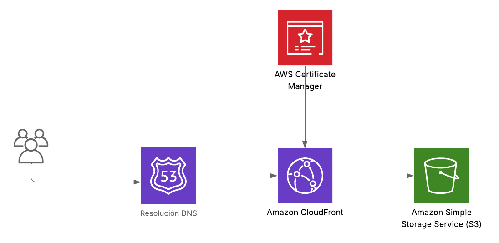

# Personal-Portfolio-Deployed-on-AWS-with-CI-CD

This project is based on my personal portfolio, deployed on AWS with secure hosting and full deployment automation using GitHub Actions.

## Architecture

The AWS infrastructure used includes:

- **Amazon Route 53**: Domain registration for `portfolio-adrianriera.com` and DNS management.
- **Amazon S3**: Storage for the portfolio's static files, with policies restricting public access, ensuring that only CloudFront can serve the content.
- **Amazon CloudFront**: CDN that distributes the content globally, aiming for low latency and high availability.
- **AWS Certificate Manager (ACM)**: TLS Certificate to enable HTTPS and secure communication.

The complete architecture follows this flow:

A detail of the portfolio is that it detects the CloudFront Edge Location to which the user is connected. As shown in the example, I connect via a VPN to a server located in the Netherlands. CloudFront, upon detecting this, finds the Edge Location with the lowest possible latency to distribute the content (In this case, it was an Edge Location in London):

## Security

- TLS encryption via ACM.

- Access to the S3 bucket is restricted solely to CloudFront.
- Least-privilege policy for the GitHub Actions deployment user (`gh-actions-portfolio`). This is where we extract (`AWS_ACCESS_KEY_ID` and `AWS_SECRET_ACCESS_KEY`).

## Automation with GitHub Actions

Every push to the `main` branch automatically triggers the deployment workflow, which:

1. Syncs the project files with the S3 bucket (`portfolio-adrian-prod`).
2. Invalidates the CloudFront distribution cache so that users receive the most recent version.
3. Uses GitHub secrets (`AWS_ACCESS_KEY_ID` and `AWS_SECRET_ACCESS_KEY`) for secure authentication with AWS.

The IAM policy associated with the deployment user allows only:

- `s3:PutObject` and `s3:DeleteObject` operations on the specific bucket.
- Creation of invalidations on the CloudFront distribution.

## Costs

Taking an example of **~400 requests per month**, the prices would be practically **€0**.

Below are the services and their approximate costs (source: official AWS Europe prices, August 2025, EU-South-2 region):

- **Amazon S3 (static storage):**
  - In this case, where the content does not exceed 5GB stored, it is practically free.

- **Amazon CloudFront (global CDN):**
  - Billing would start upon reaching 1 GB of data transfer (which would not be the case for a portfolio).
  - 400 requests ≈ **€0.00** (charged per million requests).

- **Amazon Route 53 (domain and DNS management):**
  - `.com` domain registration ≈ **€15/year**
  - Hosted Zone ≈ **€0.40/month**

- **AWS Certificate Manager (ACM):**
  - TLS Certificates issued by ACM → **Free**

📌 **Total estimated annual cost:** ~**€20-22/year**

## Problems and Solutions
### Problem 1: ACM Certificate
The main problem I encountered was when creating the ACM Certificate, as CloudFront only accepts ACM certificates that are in the `us-east-1` region.
### Problem 2: Alias in Route 53
Another problem that I quickly resolved was to create the Aliases in Route 53 for both the root domain (`portfolio-adrianriera.com`) and the `www` subdomain. Both aliases must be pointing to the created CloudFront distribution.

## Deployment

The link to access the portfolio: [https://portfolio-adrianriera.com](https://portfolio-adrianriera.com)

