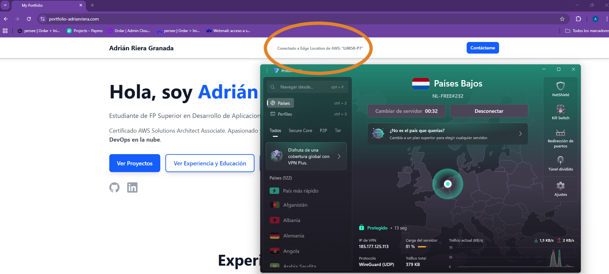
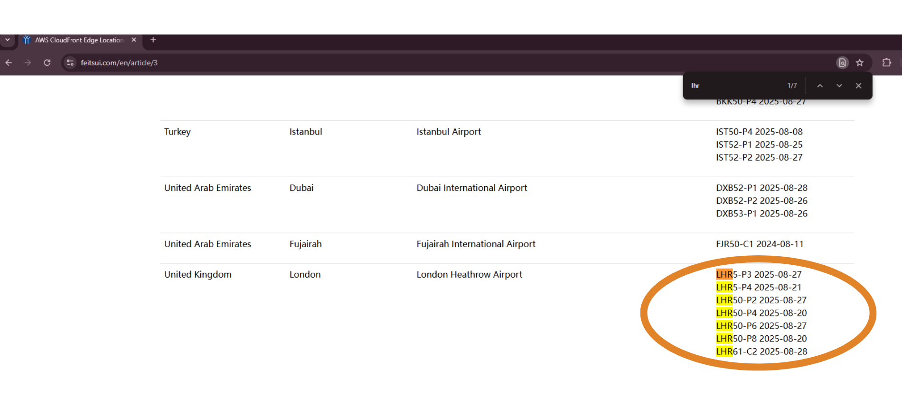
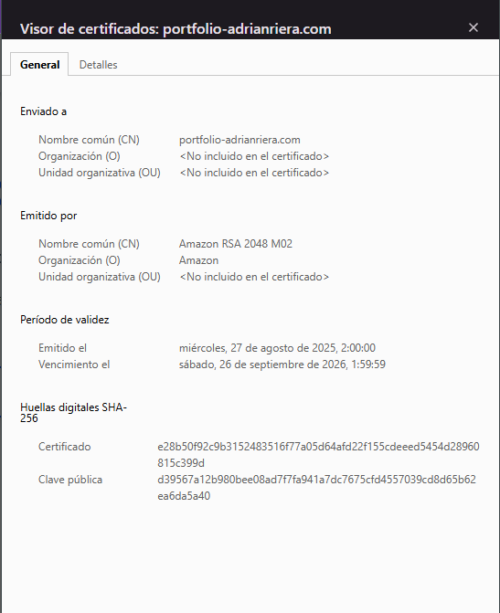
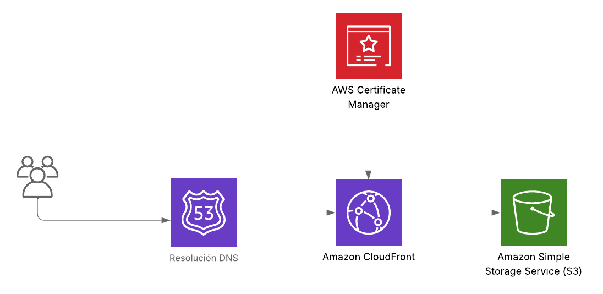

# Portfolio-Personal-Desplegado-en-AWS-con-CI-CD

Este proyecto se basa en mi portfolio personal desplegado en AWS, con hosting seguro y automatización completa de despliegue mediante GitHub Actions.

## Arquitectura

La infraestructura de AWS utilizada incluye:

- **Amazon Route 53**: Registro del dominio `portfolio-adrianriera.com` y gestión de DNS.  
- **Amazon S3**: Almacenamiento de los archivos estáticos del portfolio, con políticas que restringen el acceso al público y que solo CloudFront puede servir el contenido.  
- **Amazon CloudFront**: CDN que distribuye el contenido globalmente, buscando baja latencia y alta disponibilidad.  
- **AWS Certificate Manager (ACM)**: Certificado TLS para habilitar HTTPS y asegurar la comunicación segura.  
- **AWS Shield Standard**: Protección básica contra ataques DDoS ya que se integra automáticamente con Route 53.  

La arquitectura completa sigue este flujo:

Un detalle del portfolio, es que se detecta la Edge Location de CloudFront a la que está conectado el usuario. Como muestro en el ejemplo me conecto a través de una VPN a un servidor localizado en Países Bajos. CloudFront al detectarlo, me busca el Edge Location con la menor latencia posible para distribuirme el contenido (En este caso ha sido una Edge Location en London):

## Seguridad

- Cifrado TLS mediante ACM.
  

- Acceso al bucket S3 restringido únicamente a CloudFront.  
- Política de menor privilegio para el usuario de despliegue de GitHub Actions (`gh-actions-portfolio`). Aquí es donde sacamos (`AWS_ACCESS_KEY_ID` y `AWS_SECRET_ACCESS_KEY`).
- AWS Shield Standard protección contra ataques DDoS

## Automatización con GitHub Actions

Cada push a la rama `main` dispara automáticamente el workflow de despliegue que:

1. Sincroniza los archivos del proyecto con el bucket S3 (`portfolio-adrian-prod`).  
2. Invalida la caché de la distribución CloudFront para que los usuarios reciban la versión más reciente.  
3. Usa secretos de GitHub (`AWS_ACCESS_KEY_ID` y `AWS_SECRET_ACCESS_KEY`) para autenticar con AWS de forma segura.

La política IAM asociada al usuario de despliegue permite únicamente:

- Operaciones `s3:PutObject` y `s3:DeleteObject` sobre el bucket específico.  
- Creación de invalidaciones en la distribución de CloudFront.

## Costes

Poniendo un ejemplo de **~400 requests al mes**, los precios serían prácticamente **0 €**.

A continuación, los servicios y sus costes aproximados (fuente: precios oficiales de AWS Europa, agosto 2025, región EU-South-2):

- **Amazon S3 (almacenamiento estático):**
  - Para este caso donde el contenido no supera los 5GB almacenados es prácticamente gratuito

- **Amazon CloudFront (CDN global):**
  - Se empezaría a cobrar al llegar a 1 GB de transferencia de datos (para un portfolio no sería el caso)
  - 400 requests ≈ **0,00 €** (se cobran por cada millón de peticiones)

- **Amazon Route 53 (gestión de dominio y DNS):**
  - Registro de dominio `.com` ≈ **15 €/año**
  - Zona hosteada  ≈ **0,40€/mensual**

- **AWS Certificate Manager (ACM):**
  - Certificados TLS emitidos por ACM → **Gratis**

- **AWS Shield Standard:**
  - Protección básica DDoS incluida → **Gratis**
  
📌 **Coste anual estimado total:** ~**20-22 €/año**

## Problemas y soluciones
### Problema 1: Certificado ACM
El principal problema que me he encontrado ha sido a la hora de hacer el Certificado de ACM, ya que CloudFront solo acepta certificados de ACM que estén en la región us-east-1.
### Problema 2: Alias en Route 53
Otro problema que he solucionado rápidamente ha sido no crear los Alias en Route 53 tanto para el dominio raíz (portfolio-adrianriera.com) y el subdominio www. Ambos alias tienen que estar apuntando a la distribución de CloudFront creada.

## Despliegue

El link para acceder al portfolio: [https://portfolio-adrianriera.com](https://portfolio-adrianriera.com)

